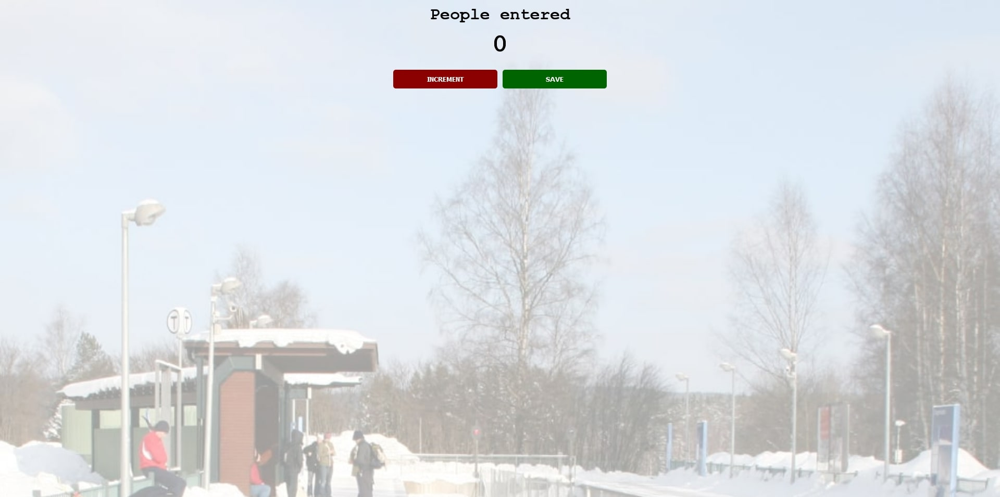

# CounterApp

## Table of contents

- [Overview](#overview)
  - [The challenge](#the-challenge)
  - [Links](#links)
- [My process](#my-process)
  - [Built with](#built-with)
  - [What I learned](#what-i-learned)
  - [Continued development](#continued-development)
  - [Useful resources](#useful-resources)
- [Author](#author)

## Overview

### The challenge

A StationMaster ask me to create a counter so he can count the passenger!

### Links

- Solution URL: (https://github.com/stathislag/CounterApp)
- Live Site URL: (https://stathislag.github.io/CounterApp/)

## My process

### Built with

- HTML5 
- CSS 
- Javascript

### What I learned

Some of my major learnings while working through this project. Was stracture my project in Html,Css and Javascript learn new properties around css, new consepts in Javascript how to call function inside markup with onclick, about local scope and global scope.

### Continued development

In future projects i would like to learn more consepts about vannilla Js and try out new techniques.

### Useful resources
This helped me with the building process and answered all my questions:
- [Resource 1](https://developer.mozilla.org/).
- [Resource 2](https://www.w3schools.com/css/css_rwd_mediaqueries.asp).

## Author

- Website - [Stathis](https://github.com/stathislag)
